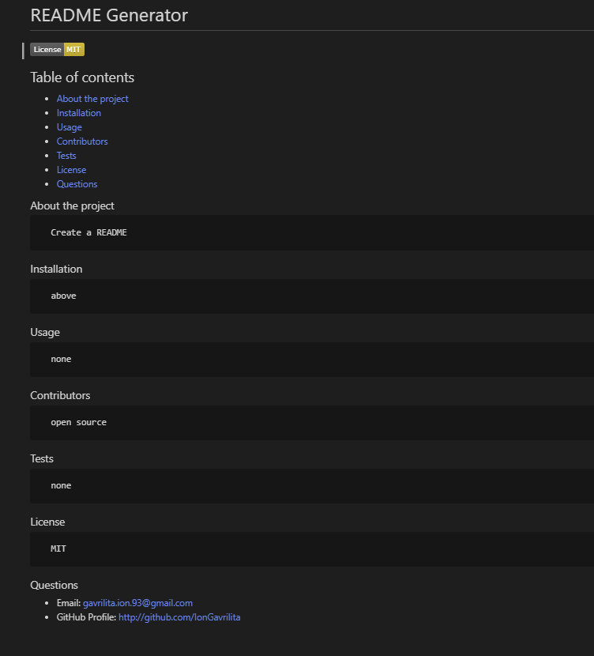
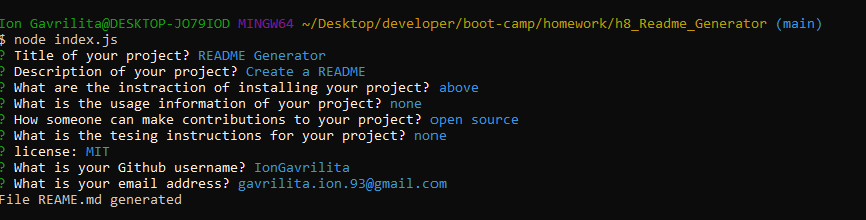

# Readme generator
This command line APP dynamically generates a professional README.md file from a user's input. You can quickly and easily generate a README file by using a command-line application to generate one. This allows the project creator to devote more time working on the project.
### README contents:

* [User Story](#User-Story)
* [Images with application functionality](#Images-with-application-functionality)
* [Tech/framework used](#Tech/framework-used)
* [Installation](#Installation)
* [Project Link & Repository](#Project-Link-&-Repository)
* [Contributors](#Contributors)
* [License](#License)

### User Story
```
GIVEN a command-line application that accepts user input
WHEN I am prompted for information about my application repository
THEN a high-quality, professional README.md is generated with the title of my project and sections entitled Description, Table of Contents, Installation, Usage, License, Contributing, Tests, and Questions
WHEN I enter my project title
THEN this is displayed as the title of the README
WHEN I enter a description, installation instructions, usage information, contribution guidelines, and test instructions
THEN this information is added to the sections of the README entitled Description, Installation, Usage, Contributing, and Tests
WHEN I choose a license for my application from a list of options
THEN a badge for that license is added near the top of the README and a notice is added to the section of the README entitled License that explains which license the application is covered under
WHEN I enter my GitHub username
THEN this is added to the section of the README entitled Questions, with a link to my GitHub profile
WHEN I enter my email address
THEN this is added to the section of the README entitled Questions, with instructions on how to reach me with additional questions
WHEN I click on the links in the Table of Contents
THEN I am taken to the corresponding section of the README
```
### Images with application functionality:

|  |  |

### Tech/framework used:
* Node JS

### Installation  
* Copy repository on your local machine
* Create a `.gitignore` file and include `node_modules/` and `.DS_Store/` so that your `node_modules` directory isn't tracked or uploaded to GitHub. Be sure to create your `.gitignore` file before installing any npm dependencies.
* Run npm install  in your terminal
* Run node index.js
* Answer the questions and after the README will be generated in your folder

### Project Link & Repository
- Functionality of the App Youtube Link- (https://youtu.be/ghl6-idKALk)
- Repository Link - (https://github.com/IonGavrilita/README_Generator)

### Contributors
* Name: Ion Gavrilita
- Email: gavrilita.ion.93@gmail.com
- Github profile: https://github.com/IonGavrilita
### License
This project is licensed under MIT
[](https://opensource.org/licenses/MIT)

